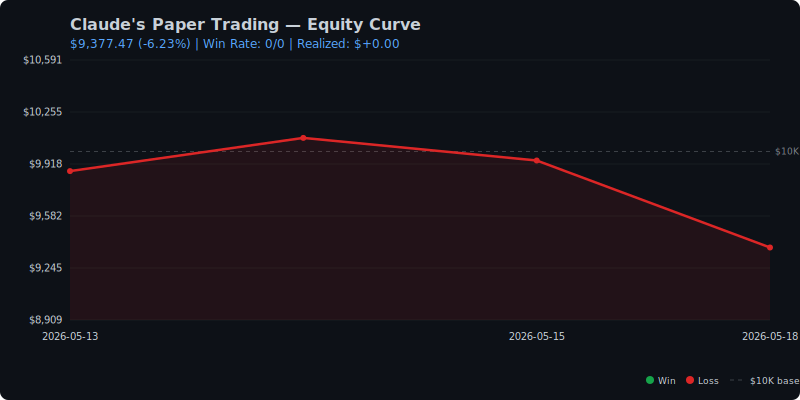

# Stock Intelligence Pipeline

Automated daily stock screening, technical analysis, portfolio monitoring, and AI-powered morning briefs.

## Claude's Paper Trading Performance



*Claude starts with $10K, buys its own top picks, and auto-exits at fib targets or stop losses. Updated daily.*

## Architecture

```
EC2 (t2.micro, us-east-1)
├── 9:50 AM ET  →  Portfolio Analysis Bot
│   ├── fetch_portfolio.py     Pulls Robinhood holdings
│   └── analyze_portfolio.py   Claude Opus 4.6 analyzes: exit targets, stops, trim/hold/add
│
├── 10:00 AM ET →  Stock Screener Pipeline
│   ├── screener.py            Screens ~2700 US stocks (EMA, momentum, volume)
│   ├── wsb_sentiment.py       Scrapes WSB for top 5 trending tickers + sentiment
│   ├── news_agent.py          Fetches technicals + news, Claude generates morning brief
│   └── send_email.py          Sends HTML email + uploads to S3
│
Local Mac (launchd at 10:30 AM)
└── sync_results.sh            Syncs S3 → local for CSV viewing
```

## Morning Email Contains

1. **Screener table** — all stocks passing filters, sortable CSV
2. **Top 20 movers** — entry price → exit target with fib levels, thesis, support
3. **Claude's Top Picks** — 3-5 swing trade picks with upside/risk
4. **Avoid list** — overextended names to stay away from
5. **WSB Sentiment Check** — top 5 WSB tickers, Claude agrees/disagrees with reasoning
6. **Portfolio Analysis** (separate email) — per-position exit targets, trim/hold/add/exit calls, new buy suggestions

## Screener Filters

- Market cap > $1B
- Price above 50-day EMA
- Positive weekly gain
- Sorted by composite momentum score (MACD 35% | ROC 30% | Volume 25% | EMA 10%)

## Technical Analysis

Each stock gets:
- Fibonacci retracements (0.236, 0.382, 0.5, 0.618) for support
- Fibonacci extensions (1.272, 1.618) for exit targets
- 50-day EMA and SMA, 200-day SMA
- RSI (14-day), MACD histogram
- Volume ratio vs 20-day average
- 20-day high/low for immediate support/resistance

## Local File Structure

```
stock/
├── results/
│   └── 2026-05/
│       ├── 2026-05-11.csv          Sortable screener data
│       ├── 2026-05-11.txt          Full screener log
│       └── 2026-05-11_brief.md     News + picks + WSB sentiment
├── portfolio_analysis/
│   └── data/
│       └── 2026-05/
│           ├── 2026-05-11.json         Raw holdings
│           └── 2026-05-11_analysis.md  Portfolio exit analysis
├── screener.py
├── news_agent.py
├── wsb_sentiment.py
├── send_email.py
├── sync_results.sh
└── view.py                    Local CLI viewer with --sort flag
```

## Setup

### Prerequisites
- Python 3.11+
- AWS account with EC2, SES, S3, Bedrock access
- Robinhood account (for portfolio bot)

### Python Dependencies
```
yfinance pandas requests lxml boto3 robin_stocks python-dotenv pyotp
```

### AWS Resources
- EC2: t2.micro with IAM role (`stock-screener-ec2`) for SES + S3 + Bedrock
- S3: Private bucket for results storage
- SES: Verified sender email
- IAM user: `stock-sync-readonly` for local sync (permanent keys)

### Cron Jobs (EC2, UTC)
```
# Portfolio analysis — 9:50 AM ET (13:50 UTC)
50 13 * * 1-5  fetch_portfolio.py && analyze_portfolio.py

# Stock screener + news — 10:00 AM ET (14:00 UTC)
0 14 * * 1-5   screener.py && news_agent.py && send_email.py
```

### Local Sync (launchd)
```
# 10:30 AM weekdays — syncs S3 results + portfolio analysis locally
com.stock.sync.plist → sync_results.sh
```

## Configuration

### .env (screener — not needed, uses NASDAQ public API)

### portfolio_analysis/.env
```
RH_EMAIL=your_email
RH_PASSWORD=your_password
RH_TOTP_SECRET=optional_for_auto_2fa
```

## Models

- **News Agent**: Claude Opus 4.6 (1M context) via AWS Bedrock
- **Portfolio Analysis**: Claude Opus 4.6 (1M context) via AWS Bedrock

## Getting Started (for others)

### Quick Deploy

```bash
git clone https://github.com/kai-ion/stock-intelligence.git
cd stock-intelligence

# One command deploys everything to your EC2:
./deploy.sh --ip <EC2_IP> --key <path/to/key.pem> --email <your@email.com> --bucket <s3-bucket>
```

This installs dependencies, uploads scripts, configures environment variables, and sets up cron jobs.

### Prerequisites

Before running `deploy.sh`, you need:

1. **AWS Account** with an EC2 instance (t2.micro free tier works)
2. **IAM Role** attached to EC2 with permissions for:
   - `ses:SendEmail`, `ses:SendRawEmail`
   - `s3:PutObject`, `s3:GetObject`, `s3:ListBucket`
   - `bedrock:InvokeModel`
3. **S3 Bucket** — `aws s3 mb s3://your-bucket-name`
4. **SES Verified Email** — `aws ses verify-email-identity --email-address your@email.com`
5. **SSH Key** for EC2 access

### Deploy Options

```bash
./deploy.sh \
  --ip 1.2.3.4 \
  --key ~/.ssh/my-key.pem \
  --email you@gmail.com \
  --bucket my-stock-bucket \
  --region us-east-1 \
  --model us.anthropic.claude-opus-4-6-v1
```

| Flag | Required | Description |
|------|----------|-------------|
| `--ip` | Yes | EC2 public IP |
| `--key` | Yes | Path to SSH .pem key |
| `--email` | Yes | Email for reports (must be SES-verified) |
| `--bucket` | Yes | S3 bucket name |
| `--region` | No | AWS region (default: us-east-1) |
| `--model` | No | Bedrock model ID (default: Claude Opus 4.6) |

### Local Sync (optional)

```bash
# Copy and configure the sync script
cp sync_results.sh.example sync_results.sh
chmod +x sync_results.sh
# Edit with your bucket name and paths

# Create an IAM user with read-only S3 access
# Add keys to ~/.aws/credentials under [stock-sync] profile
# Set up macOS launchd or crontab to run sync_results.sh at 10:30 AM
```

### Portfolio Bot (optional)

```bash
# Create credentials file on EC2
ssh -i key.pem ec2-user@YOUR_IP
cat > /home/ec2-user/portfolio/.env << EOF
RH_EMAIL=your_robinhood_email
RH_PASSWORD=your_password
RH_TOTP_SECRET=your_totp_secret
EOF

# Run once to establish session (approve device in Robinhood app)
cd /home/ec2-user/portfolio && python3.11 fetch_portfolio.py
```

### Notes

- The screener processes ~2700 tickers in batches of 50 with pauses to avoid Yahoo Finance rate-limiting. Top daily movers are prioritized first.
- SES sandbox mode routes emails to spam — create a Gmail filter ("Never send to Spam" from your sender address) or request SES production access.
- The Robinhood session pickle expires after 24 hours of inactivity. The daily cron keeps it alive on weekdays. After a weekend, you may need to re-approve on Monday.
- Adjust `MODEL_ID` to use a different Claude model (e.g., `us.anthropic.claude-sonnet-4-6` for faster/cheaper runs).
